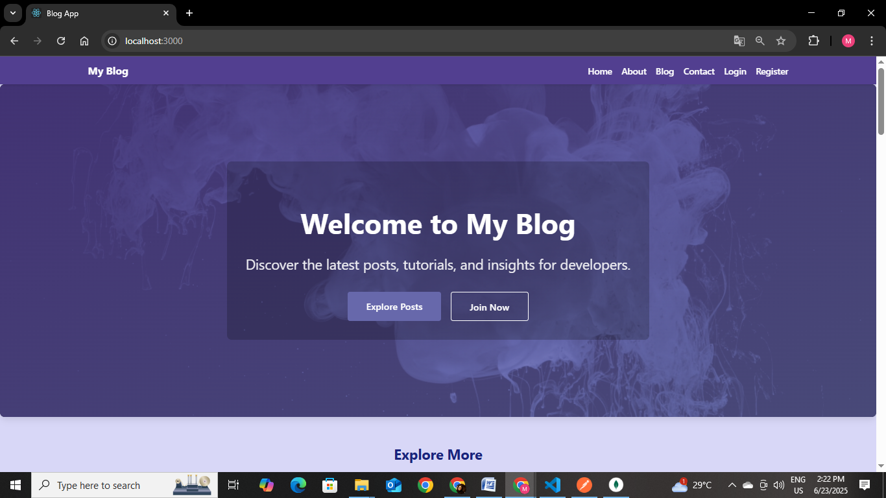
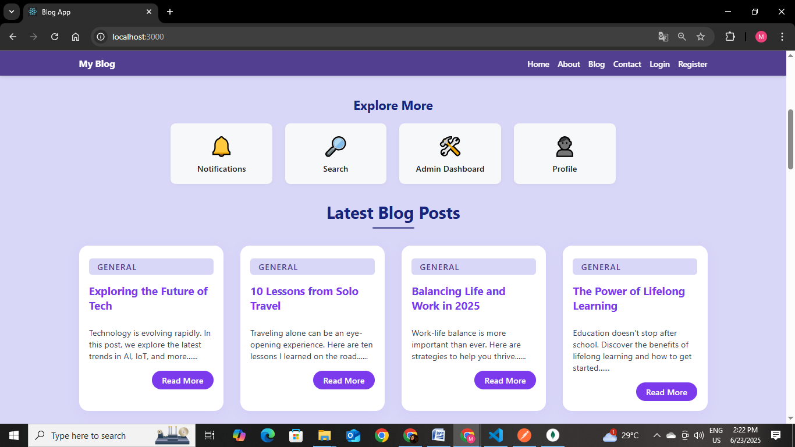

# My Blog App

A full-stack MERN (MongoDB, Express, React, Node.js) blog platform with user authentication, admin dashboard, notifications, and search functionality.

---



## 🚀 Features

- **User Authentication:** Register, login, and secure your account.
- **Blog Posts:** Create, read, update, and delete blog posts.
- **Admin Dashboard:** Manage users and posts with an easy-to-use interface.
- **Notifications:** See important updates and blog activity.
- **Search:** Search blog posts by keyword.
- **Responsive UI:** Clean, modern, and mobile-friendly design.

---

## 🗂️ Project Structure

```
blog-app/
│
├── client/          # React frontend
│   └── src/
│       └── pages/
│           ├── Home.jsx
│           ├── Login.jsx
│           ├── Register.jsx
│           ├── AdminDashboard.jsx
│           ├── Notifications.jsx
│           └── Search.jsx
│       └── utils/
│           └── api.js
│       └── theme.css
│
├── server/          # Node/Express backend
│   ├── app.js
│   ├── models/
│   │   ├── User.js
│   │   └── Post.js
│   ├── routes/
│   │   ├── auth.js
│   │   ├── posts.js
│   │   ├── admin.js
│   │   └── notifications.js
│   └── ...
│
└── README.md
```

---

## ⚙️ Setup Instructions

### 1. **Clone the Repository**

```bash
git clone https://github.com/your-username/blog-app.git
cd blog-app
```

### 2. **Install Dependencies**

#### Backend

```bash
cd server
npm install
```

#### Frontend

```bash
cd ../client
npm install
```

### 3. **Configure Environment**

- Make sure MongoDB is running locally (`mongodb://localhost:27017/myblog` by default).
- You can adjust the DB connection in `server/app.js` if needed.

### 4. **Start the Application**

#### Backend

```bash
cd server
node app.js
```

#### Frontend

```bash
cd ../client
npm start
```

- Frontend will run on [http://localhost:3000](http://localhost:3000)
- Backend API will run on [http://localhost:5050](http://localhost:5050)

---

## 📝 Usage

- **Register/Login:** Create an account or log in.
- **Create Posts:** Add new blog posts from your dashboard.
- **Admin Dashboard:** Manage users and posts (admin only).
- **Notifications:** View site-wide or user-specific notifications.
- **Search:** Use the search bar to find posts by keyword.

---

## 🛠️ Key Endpoints

| Endpoint                    | Purpose                        |
|-----------------------------|--------------------------------|
| `POST /api/auth/register`   | Register a new user            |
| `POST /api/auth/login`      | Login                          |
| `GET /api/posts`            | Get all posts                  |
| `GET /api/posts?search=...` | Search posts                   |
| `POST /api/posts`           | Create a new post              |
| `GET /api/notifications`    | Get notifications              |
| `/admin/users`              | List all users (admin)         |
| `/admin/posts`              | List all posts (admin)         |

---

## 👤 Admin Access

- To access the admin dashboard, log in as a user with `role: "admin"` in MongoDB.
- You can manually update a user in MongoDB Compass:
  ```js
  db.users.updateOne({ email: "youradmin@email.com" }, { $set: { role: "admin" } })
  ```

---

## 📦 Dependencies

- **Backend:** express, mongoose, cors, bcrypt, jsonwebtoken
- **Frontend:** react, axios, react-router-dom

---

## 🧪 Testing

- Test endpoints with Postman or your browser.
- Use the UI to verify notifications, search, and admin features.
- For troubleshooting, check your browser console and backend logs.

---

## 🤝 Contributing

Pull requests are welcome! For major changes, open an issue first to discuss what you would like to change.

---

## 📄 License

This project is open source and available under the [MIT License](LICENSE).
